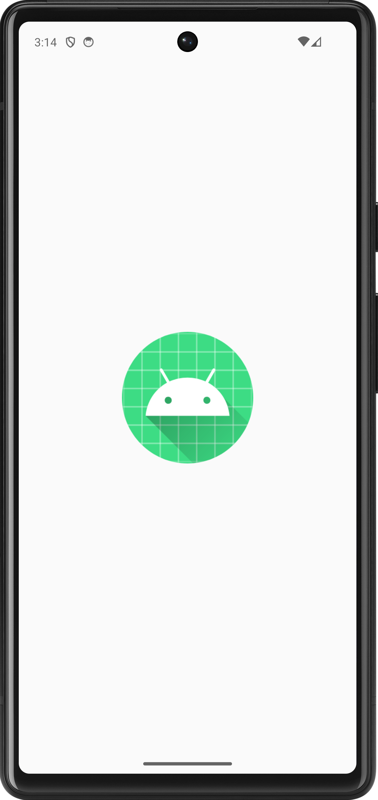
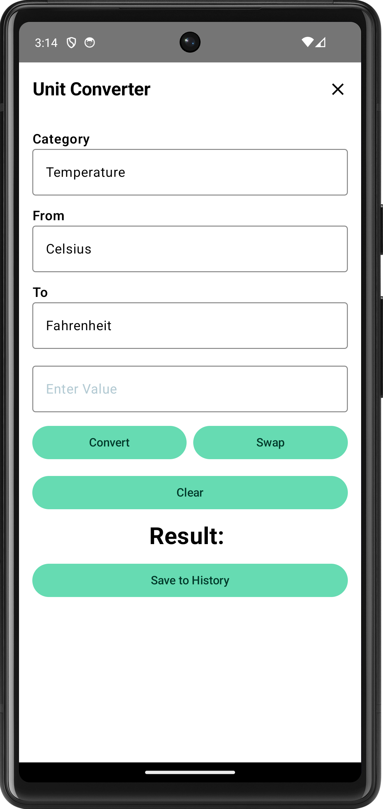
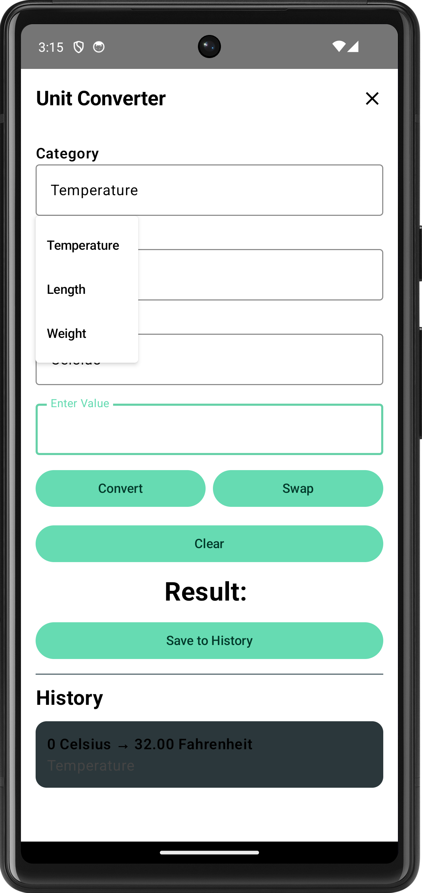
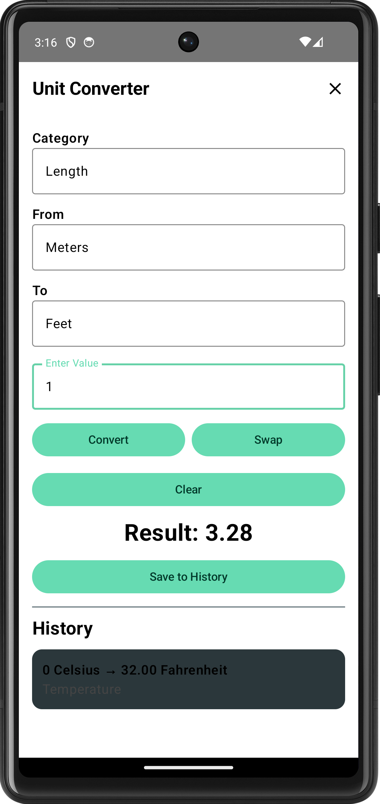
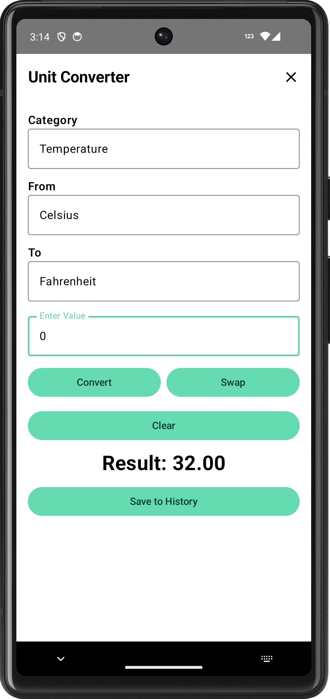
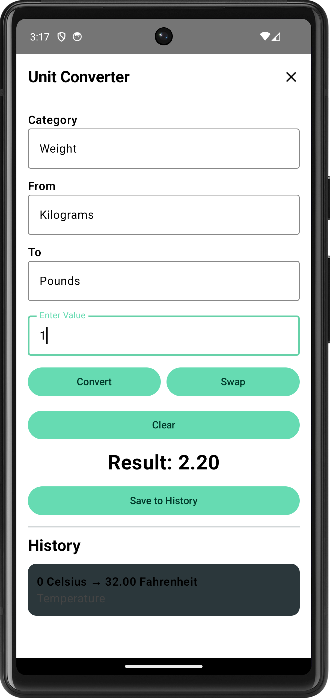

## Unit Converter Android Kotlin

Unit Converter Android Kotlin is a mobile application built in Android Studio using Kotlin and Jetpack Compose. The app allows users to convert values between different unit categories, including length, temperature, and weight. It includes dropdown menus, a clear button, a swap feature, and a history option to save previous conversions during the app session.

## Features

- Convert values between different unit categories
- Supports length, temperature, and weight conversions
- Dropdown menus for category and unit selection
- Swap button to switch input and output units
- Clear button to reset the input and result
- Save conversions to history
- Clean and readable user interface

## Concepts Demonstrated

- Kotlin programming
- Jetpack Compose UI design
- ViewModel usage
- State management
- Unit testing
- Dependency injection with Hilt
- User input handling
- Dropdown menu interaction
- Basic app navigation and layout design

## Technologies used

- Kotlin
- Android Studio
- Jetpack Compose
- Material 3
- Hilt
- JUnit
- MockK
- Gradle
- GitHub

## Project Structure

```text
unit-converter-android-kotlin/
├── app/
│   ├── src/
│   │   ├── main/
│   │   │   ├── java/com/example/unitconverter/
│   │   │   │   ├── domain/
│   │   │   │   ├── model/
│   │   │   │   ├── ui/
│   │   │   │   ├── viewmodel/
│   │   │   │   ├── MainActivity.kt
│   │   │   │   └── UnitConverterApp.kt
│   │   └── test/
│   │       └── java/com/example/unitconverter/viewmodel/
│   └── build.gradle.kts
├── gradle/
├── screenshots/
├── README.md
└── settings.gradle.kts
```

## How to Run
This project can be opened and run using Android Studio.

### Prerequisites
- Android Studio installed
- Android emulator or physical Android device
- Kotlin and Gradle support enabled in Android Studio

### Steps
1. Clone or download the repository.
2. Open the project in Android Studio.
3. Allow Gradle to sync.
4. Select an emulator or connected Android device.
5. Click the Run button.
6. Use the dropdown menus to choose a category and units.
7. Enter a value and select Convert.

## Examples

Example ViewModel unit test:

```text
@Test
fun convert_delegatesToEngine_andSetsResult() {
    viewModel.category = "Temperature"
    viewModel.inputUnit = "Celsius"
    viewModel.outputUnit = "Fahrenheit"
    viewModel.inputValue = "100"

    every {
        engine.convert("Temperature", "Celsius", "Fahrenheit", "100")
    } returns "212.00"

    viewModel.convert()

    assertEquals("212.00", viewModel.result)
}
```
Example conversion result:
```text
100 Celsius = 212.00 Fahrenheit
1 Meter = 3.28 Feet
2.5 Kilograms = 5.51 Pounds
```

## What I learned

While working on this project, I learned how to build a functional Android application using Kotlin and Jetpack Compose. I practiced creating a clean user interface, managing user input, using dropdown menus, and updating app state through a ViewModel. I also learned how to use Hilt for dependency injection and how to write unit tests with JUnit and MockK. This project helped me better understand how app logic, UI design, and testing work together in Android development.

## Future Improvements

- Save conversion history permanently
- Add more unit categories
- Add dark mode support
- Improve input validation messages
- Add UI tests
- Add animations for a smoother user experience
- Add a settings screen

## Screenshots

### App Loading


### Converter Home


### Category Dropdown


### Length Conversion


### Temperature Conversion


### Weight Conversion

